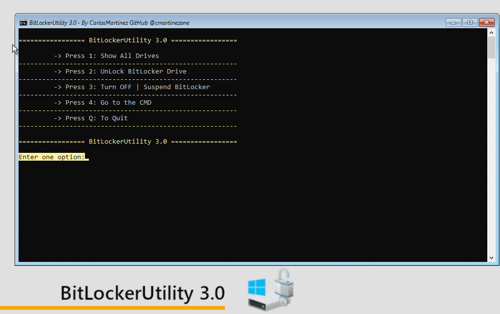

# BitLockerUtility 3.0
The tool that can help the IT Support users, It is designed so that users who have problems starting the computer with an encrypted hard drive to retrieve the information in it.

BitLocker Is the hard disk encryption technology from Microsoft. This technology is included by default in the Professional and Enterprise edition of Windows 10 and allows users to encrypt all data on the drives so that they are stored securely.

If our computer and the operating system work normally we have nothing to worry about.

BitLockerUtility 3.0 Tool is based on Windows PE ( WinPE ) together with a PowerShell script wrapping windows manage-bde command-line tool in a clear and simple terminal interface so that anyone can recover the data if they have problems starting Windows.

# The Main features of this tool:
- Generates the recovery ID associated with the encrypted key.
- Unlock the units encrypted with BitLocker (Provided you have the recovery key).
- It allows you to turn off encryption, and therefore decrypt the entire in it.
- Shows all storage units, both encrypted and unencrypted.
- Open Command Line to control the system.

**BitLockerUtility 3.0 does not repair corrupted BitLocker encrypted drive units!** for more information about repairing BitLocker from the command-line, you can check Microsoft repair-bde command-line tool documentation for accessing encrypted data on a severely damaged hard disk if the drive was encrypted by using BitLocker.

# Use Cases:

- if our operating system fails or gets corrupted, we will most likely lose access to the data we had on the hard drive.
- Windows does not finish booting with a blue screen, the operating system is corrupted or when windows has not been able to repair corrupted boot files.

# Deployment:
- PXE Boot Server Integration: Download and Upload the WIM image to your PXE\WDS Server [Download](https://github.com/taymaytomo/BitLockerUtility/releases).
- Bootable USB Drive: Download the ISO File to Create a bootable USB Drive [Download](https://github.com/taymaytomo/BitLockerUtility/releases).

You can use Rufus https://rufus.ie to create a Bootable USB Drive.

# WinPE Support:
The Final ISO Image is generated using Microsoft Windows ADK together with one of my project WinPeBuilder that it helps to create WinPE Images easy and fast!

- The Windows WinPE Packages included are: **HTA, WMI, StorageWMI, Scripting, NetFx, PowerShell, DismCmdlets, FMAPI, SecureBootCmdlets, EnhancedStorage, SecureStartup (BitLocker Support).**
- Support included: [Dell WinPE Drivers](https://www.dell.com/support/article/us/en/04/how13364/winpe-10-driver-pack?lang=en)
- Support included: [HP WinPE Drivers](https://ftp.hp.com/pub/caps-softpaq/cmit/HP_WinPE_DriverPack.html)
